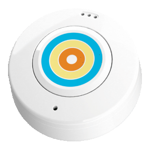
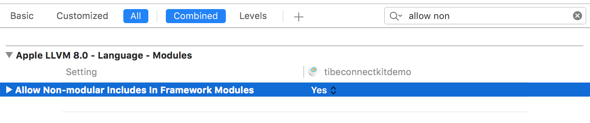
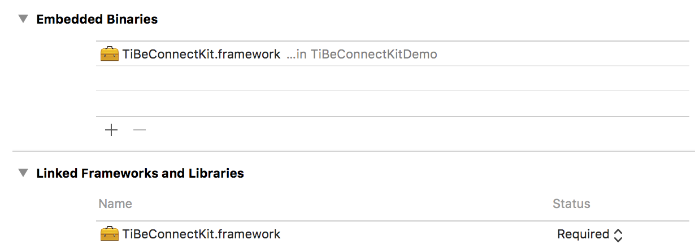
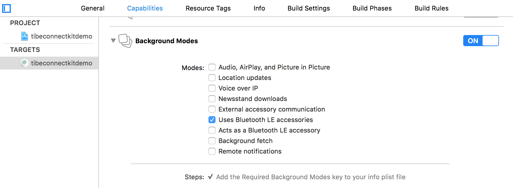

[](https://ticatag.com)

## Prerequisites
To use this SDK, you need to use the Ticatag TibeConnect button.
You can buy this button online [here](http://www.ticatag.com/categorie-produit/b2c)

## About TiBeConnect Kit for iOS

This Kit provides all the capabilities to manage the TiBeConnect button:
- Scan buttons around you
- Button connection / reconnection
- Button RSSI
- Button buzzer
- Button temperature change notification
- Button accelerometer 3 axis notifications
- Button clicks (simple, double, long press) change notification
- Mode button : with this mode the button is placed in standby and is awake only when movement is detected on the button. This feature will drastically increase button battery life.
- Button firmware version

## Set up Xcode

1. Import the TiBeConnectKit.framework file to your project.

2. Under Project Settings -> Build Settings, set the flag Allow Non-modular includes in Framework Modules to Yes.

3. Under Settings -> General, remove TiBeConnectKit.framework from Linked frameworks and Binaries since it will be automatically added in the next step.

4. Now, on the same view, press the + sign under Embedded Binaries and add TiBeConnectKit.framework from the list. This should add TiBeConnectKit.framework to Linked frameworks and Binaries as well


5. In your project **Capabilities section**, enable the Uses Bluetooth LE accessories


## Getting started

A complete working example is available
[Here](https://github.com/TicatagSAS/tibeconnectkitdemo-ios)

1. Init the framework

```objc
@interface BeaconsTableViewController ()
@property(nonatomic, strong) NSArray *liveBeacons;
@property(nonatomic, strong) TBCManager *tiBeConnectManager;
@end

@implementation BeaconsTableViewController

- (void)viewDidLoad {
    [super viewDidLoad];
    self.title = @"Beacons";

    _tiBeConnectManager = [TBCManager shared];
    _tiBeConnectManager.delegate=self;
    _liveBeacons = [NSArray array];
}
```

2.Start monitoring for ranged buttons once Bluetooth is ready
```objc
-(void)tiBeConnectManager:(TBCManager *)manager didBluetoothStateChanged:(CBManagerState)state
{
    if (state == CBManagerStatePoweredOn)
    {
        if (![manager isMonitoring])
        {
            [manager startMonitoring];
        }
    }
}

-(void)tiBeConnectManager:(TBCManager *)manager didRangeBeacon:(NSArray<TBCBeacon *>*)beacons
{
    _liveBeacons = beacons;
    [self.tableView reloadData];
}
```

3.Button connection

```objc
[_tiBeConnectManager connectBeacon: _beacon];
```

4.Connection established notification

``` objc
[[NSNotificationCenter defaultCenter] addObserverForName: TBCBeaconDidConnectNotification object:_beacon queue:nil usingBlock:^(NSNotification * _Nonnull note) {
        [_activityIndicator stopAnimating];

        [self hideScreen: NO];

        //[[NSNotificationCenter defaultCenter] removeObserver: connectionObserver];
        [_tiBeConnectManager setButtonActionsNotifications: YES forBeacon: _beacon];
        [_tiBeConnectManager setBatteryNotifications: YES forBeacon: _beacon];
        [_tiBeConnectManager setTemperatureNotifications:YES forBeacon: _beacon];

        [_tiBeConnectManager startRSSIMonitoringForBeacon: _beacon interval: 1.0 withCompletion:^(TBCManager *manager, TBCBeacon *beacon, NSError *error) {
            ;
        }];

        [_tiBeConnectManager temperatureForBeacon: _beacon withCompletion:^(TBCManager *manager, TBCBeacon *beacon, NSError *error) {
            ;
        }];

        [_tiBeConnectManager buttonModeForBeacon: _beacon withCompletion:^(TBCManager *manager, TBCBeacon *beacon, NSError *error) {
            ;
        }];

        [_tiBeConnectManager firmwareVersionForBeacon: _beacon withCompletion:^(TBCManager *manager, TBCBeacon *beacon, NSError *error) {
            ;
        }];

    }];

    [[NSNotificationCenter defaultCenter] addObserverForName: TBCBeaconDidTemperatureChangeNotification object:_beacon queue:nil usingBlock:^(NSNotification * _Nonnull note) {
        _temperatureLabel.text = [NSString stringWithFormat: @"Temperature: %d °C", [[note.userInfo objectForKey: @"value"] intValue]];
    }];
```

5.Dring dring !!

```objc
[_tiBeConnectManager pingBeacon: _beacon];
```
## Issues
 For general service questions and help consult the Ticatag  [support knowledge base](https://ticatag.zendesk.com/).

If you've found a problem in this library, perform a search under
[Issues](https://github.com/TicatagSAS/tibeconnectkit-ios/issues?q=is%3Aissue+)
in case it has already been reported. If you do not find any issue addressing it, feel free to [open a new
one](https://github.com/TicatagSAS/tibeconnectkit-ios/issues/new).

Your issue report should contain a title and a clear description of the issue at a minimum. Please provide as much relevant information as possible to replicate the issue. This should include the Java and library versions, a code
sample demonstrating the issue, and device OS information. Providing a unit test that demonstrates the issue is greatly appreciated. Your goal should be to make it easy for yourself - and others - to replicate the bug and figure out a
fix.

## License

 Copyright (c) 2016 by Ticatag
 http://www.ticatag.com

 All Rights Reserved

 Usage of this library implies agreement to abide by the [licenseterms](LICENSE) and Ticatag [terms of service](http://www.ticatag.com)
